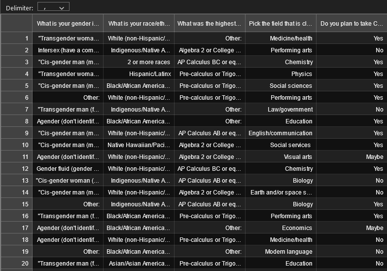

# STEM Retention by Race, Ethnicity, and Gender after Calculus I

> For more detailed descriptions of each directory's software, please refer to the README files in the individual directories. Specifically, there is a README in each of the simulate_data, interview_analysis, and survey_analysis directories.

The purpose of this study is to better understand the social factors that lead to a decline in STEM retention for underrepresented racial, ethnic, and gender groups following Calculus I. The study includes a survey given to current Calculus I students and interviews conducted with previous Calculus I students at the University of Colorado Boulder. Here, we present our analytical pipeline for the survey and interview data from this project.

This software is divided into three directories. `simulate_data` creates simulated Google Forms survey data in order to test the survey analysis software. Answers are chosen according to prescribed probabilities, and each answer has an associated "correlation" with whether or not the student will choose to take Calculus II. `survey_analysis` filters the survey data for the inputted demographic, then finds the probability they will continue on to Calculus II. `interview_analysis` uses deductive analysis by searching an interview transcript for words from a pre-determined list and counts the frequency of each word.

## Dependencies 

numpy, argparse, pycodestyle, pandas, matplotlib, string, glob, os, sys, nltk, unittest, random

## Usage examples

##### For Simulated Data

```
python create_data.py \
    --write_file_name 'sim_data/test_sim_data.csv' \
    --param_file_name 'input/parameters.txt' \
    --sample_size '200' \
    --param_delim '\t'`
```



##### For Survey Analysis 

This part of the project aims to find the probability that 
a given student will take Calculus II in the future, based 
on the inputted survey data. More details on this piece of
software can be found in the README.md file in the survey_analyis
directory.

###### Usage example
```
python probability.py \
    --file_name test_sim_data.csv \
    --gender_identity cis_W, trans_W \
    --race_ethnicity black
```
###### Sample output


##### For Interview Analysis

```
python deductive.py \
    --word_list_file_name data_files/sim_word_list.txt \
    --questions_file_name data_files/sim_ques.txt \
    --data_folder data_files \
    --current_transcripts_folder transcripts_no_audio_1st_five \
    --graphs_folder graphs
```

###### Sample output
```
sim_int_1 {'good': 2, 'well': 2, 'interested': 4, 'available': 1, 'listened': 1, 'praising': 1}
sim_int_2 {'good': 1, 'well': 2, 'interested': 1, 'interesting': 2, 'available': 1, 'listened': 1, 'praising': 1}
sim_int_3 {'good': 1, 'well': 4, 'interested': 1, 'interesting': 2, 'available': 1, 'listened': 1, 'enjoyed': 3, 'praising': 1}
sim_int_4 {'good': 2, 'well': 3, 'interesting': 2, 'available': 1, 'listened': 1, 'praising': 1}
sim_int_5 {'good': 2, 'well': 3, 'available': 1, 'listened': 1, 'enjoyed': 1, 'praising': 1}
{'good': 8, 'well': 14, 'interested': 6, 'available': 5, 'listened': 5, 'praising': 5, 'interesting': 6, 'enjoyed': 4}
```
Below are word frequency plots from one interview transcript and from five interview transcripts, respectively.

sim_int_5_word_freq.png:


total_freq_graph.png:

