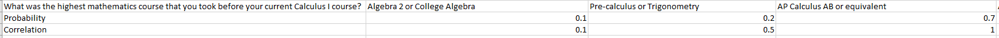
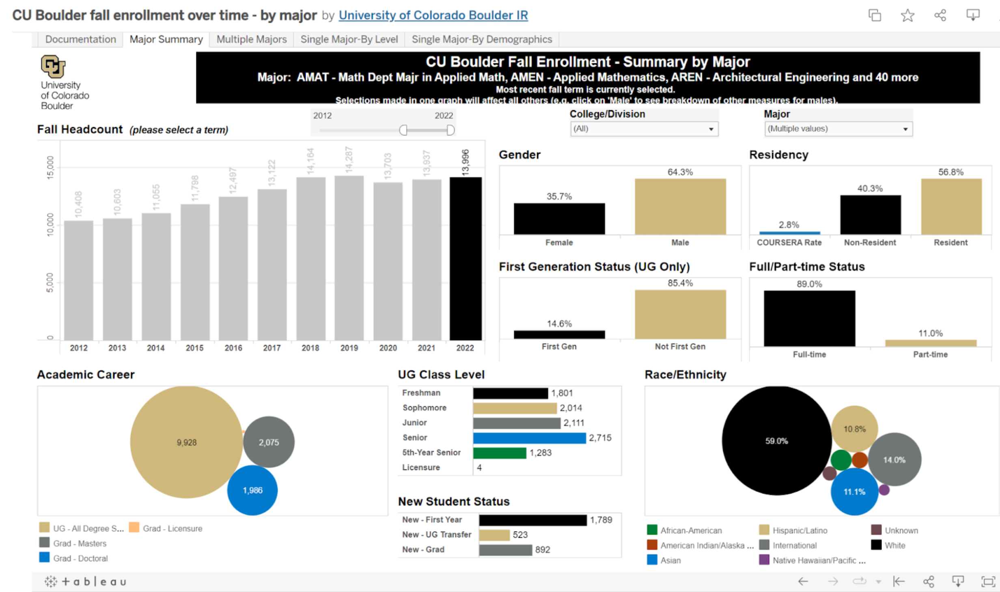

# swe4s-calculus-study: Simulated Data Directory

> This directory contains all the files necessary to create simulated Google Forms exported .csv data. 

The purpose of this directory is to create simulated Google Forms survey data in order to test the survey analysis software. Simulated survey data can also be compared to real data to see if the collected real answers match or defy expectations.

In the `input` directory, an Excel spreadsheet is used to set the different questions, each possible answer, each answer’s probability of being chosen, and each answer's "correlation" with taking Calc II. As an example, for the question "What was the highest mathematics course that you took before your current Calculus I course?", there are three answers: "Algebra 2 or College Algebra", "Pre-calculus or Trignometry", and "AP Calculus AB or equivalent".

The "Probability" row shows that 10% of all simulated students will choose Algebra 2/College Algebra, 20% will choose Pre-calculus/Trignometry, and 70% will choose AP Calculus AB. The software checks to make sure each set of inputted probabilities add to 1, and raises an `ArithmeticError` if this is violated.

The "Correlation" row indicates that if a student chooses Algebra 2/College Algebra, they are 90% LESS likely to take Calculus II. If a student chooses Pre-calculus/Trignometry, they are 50% less likley to take Calculus II. Finally, if a student takes AP Calculus AB or equivalent, they are not more or less likely to take Calculus II. Correlations can only be less than 1, they cannot be greater than 1 in the current implementation. Additionally, *if a correlation value is less than the probability of choosing Calculus II (0.178 in the current code based on research)*, then a student with that answer will never choose to take Calculus II. This is just something to be aware of when simulating data.

The spreadsheet must be exported as a tab delimited .txt file to be read out by the software. Be sure that all significant figures show in the Excel file, otherwise when exported, the extra figures will not be written. From this text file, a .csv file is generated and made to look like exported survey data from Google forms from the study. An example of the simulated survey data is shown below.

## Installation

N/A

## Dependencies 

numpy, argparse, pycodestyle

## Usage example

`python create_data.py --write_file_name 'sim_data/test_sim_data.csv' --param_file_name 'input/parameters.txt' --sample_size '200' --param_delim '\t'`

## Baseline Data

CU Boulder collects [census data](https://www.colorado.edu/oda/student-data/enrollment/fall-census) every fall. When sorted by all majors required to take Calculus II, we have an estimate of the expected demographics for a typical Calculus I section at CU Boulder. An Excel spreadsheet with CU Fall Census data for gender and race is included in the `input` directory. Note that the Fall Census data does not include gender identities other than Male or Female (which this study aims to rectify!). For now, the probability of all other gender identities aside from Cis-Male and Cis-Female are 0 in that Excel sheet.

