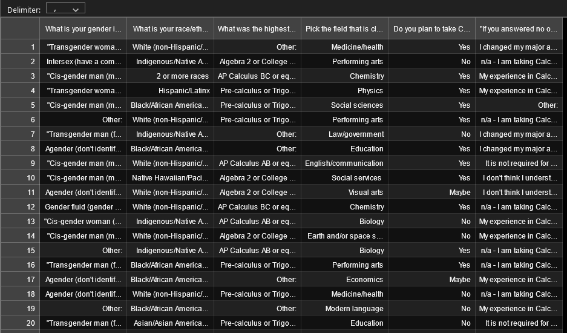

# swe4s-calculus-study: Simulated Data Directory

> This directory contains all the files necessary to create simulated Google Forms exported .csv data. 

The purpose of this directory is to create simulated Google Forms survey data. In the input directory, an Excel spreadsheet is used to set the different questions, as well as each answer and each answer’s probability of being chosen. The spreadsheet is then saved as a text file to be read out by the code. From this text file, a .csv file is generated and made to look like exported survey data from Google forms. 

## Installation

N/A

## Dependencies 

numpy, argparse, pycodestyle

## Usage example

`python create_data.py --write_file_name 'sim_data/test_sim_data.csv' --param_file_name 'input/parameters.txt' --sample_size '200' --param_delim '\t'`

## Contributing

1. Fork it (<https://github.com/yourname/yourproject/fork>)
2. Create your feature branch (`git checkout -b feature/fooBar`)
3. Commit your changes (`git commit -am 'Add some fooBar'`)
4. Push to the branch (`git push origin feature/fooBar`)
5. Create a new Pull Request
